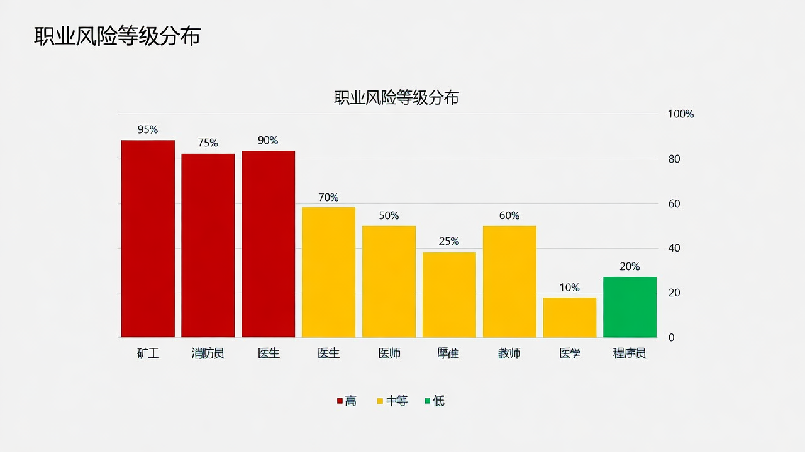
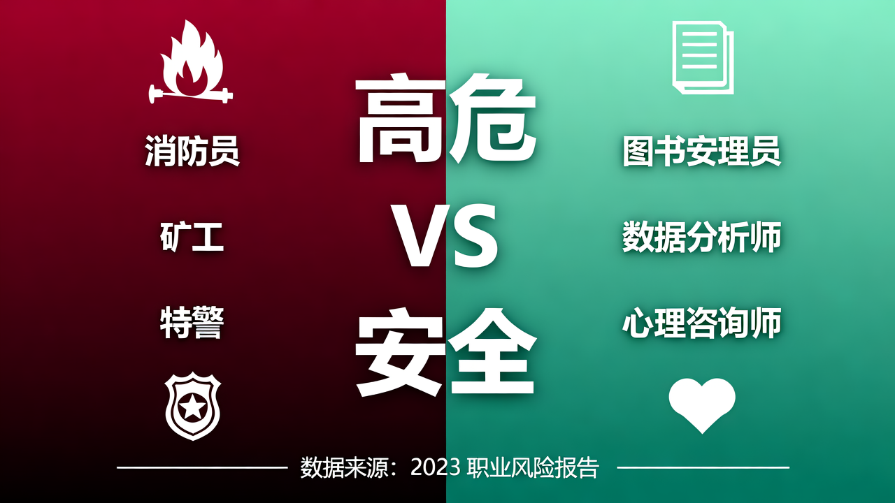
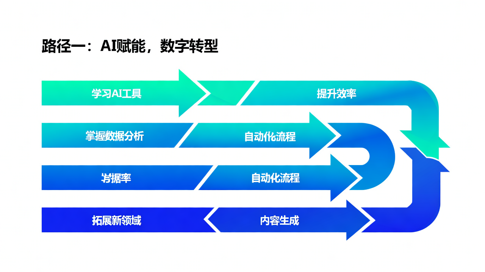
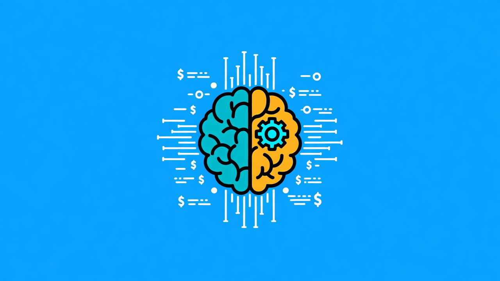

# AI时代生存指南：2026年，你的工作会被取代吗？

> ⏱️ **预计阅读时长**: 18-22分钟 | 📊 **字数**: 6500字（已更新：增加人形机器人影响分析）

---

## 🔥 开头：风暴将至

2030年，全球将有**9200万个岗位**被AI取代。

> 💥 这不是危言耸听，这是**世界经济论坛**的预测。

而更关键的是：这个浪潮，已经开始了。

---

2025年，一个5年经验的Java工程师投了**100份简历**，只获得**2个面试机会**。

为什么？

因为ChatGPT能以他**1%的成本**，完成他**80%的工作**。

---

2026年，AI将从"工具"变成**"劳动力"**。

🤔 **你的工作，会在这场变革中幸存吗？**

如果这个问题让你感到焦虑，你不是一个人。

---

今天，我要给你一份**"AI时代职业生存指南"**——帮你判断风险、规划转型、掌握技能。

✅ 这不是制造恐慌，而是让你有备无患。

---

### 📸 配图1：黑客帝国风格


*图：黑客帝国风格的代码雨，象征AI时代的到来*

---

## 📊 第一章：风险自测——你的岗位有多危险？

### ✅ 测试你的风险等级

想知道你的工作是否会被AI取代？**三个问题**，帮你快速判断：

---

#### ❓ 问题1：你的工作内容是否标准化？

如果你的工作有明确的规则和流程，比如：
- 数据录入
- 基础代码编写
- 标准化文案写作
- 重复性客服问答

🚨 **那么，你处于高危区。**

---

#### ❓ 问题2：你的工作是否包含大量重复性劳动？

如果你每天做的事情大同小异，比如：
- 处理相似的报表
- 回复相同的问题
- 按固定流程操作

🚨 **那么，你处于高危区。**

---

#### ❓ 问题3：你的工作是否需要复杂的人际沟通和情感交互？

如果你的工作需要：
- 💬 理解他人情绪
- 🤝 协调复杂关系
- ❤️ 提供情感支持
- ⚡ 灵活应对突发情况

✅ **那么，恭喜你，你处于安全区。**

---

### ⚠️ 微软研究揭示：高危岗位TOP10

根据**微软研究院**的重磅研究，这些岗位替代风险最高：

| 排名 | 岗位 | 风险 |
|------|------|------|
| 1 | 数学家 | 100% |
| 2 | 税务筹划师 | 100% |
| 3 | 柜台和租赁人员 | 81% |
| 4 | 销售经理 | 79% |
| 5 | 运输、接收和库存文员 | 76% |
| 6 | 编辑 | 75% |
| 7 | 程序员 | 70% |
| 8 | 法律秘书、行政助理 | 70%+ |

💡 **关键洞察**：这些高危岗位有一个共同特征——**标准化程度高、重复性劳动多、无需复杂物理操作**。

---

### 📊 国内数据：智联招聘2025年报告

> 🇨🇳 **以上数据来自微软研究院的全球研究，那么中国国内的情况呢？**

根据**智联招聘2025年中国人工智能产业人才报告**，国内AI岗位需求呈现**爆发式增长**：

| 岗位类型 | 需求增速 | 说明 |
|----------|----------|------|
| 🔥 算法工程师 | **+110.1%** | 需求翻倍增长 |
| 🎯 AI产品经理 | **+178%** | 最抢手岗位 |
| 👁️ 机器视觉 | **+36.6%** | 计算机视觉领域 |
| 🤖 机器人算法 | **+30.7%** | 自动化领域 |
| 📈 AI行业整体 | **+19%** | 同比增长 |

**💰 薪资水平**：多数AI岗位薪资集中在**1-3万元/月**，技术岗位可达**5万+**。

**👥 求职热度**：AI相关岗位求职人数年比增长**69.6%**，位居行业榜首。

💡 **国内实际情况**：
- 与国外不同，国内**AI产业正处于快速发展期**
- **岗位需求激增**，但技能要求也在提高
- **复合型人才**更受青睐（技术+业务）
- **人机协作模式**被63.1%的职场人认可

---

### 🛡️ 安全岗位TOP10

哪些岗位最安全？微软公布的**"黄金职业"**：

1. 🩺 抽血师
2. 👩‍⚕️ 护理师助理
3. ⚠️ 危险品清除工人
4. 🎨 油漆工、泥水匠
5. ⚰️ 遗体防腐师
6. 🚢 疏浚操作员
7. 🌉 桥梁和水闸管理员

💡 **共同特征**：需要**复杂物理操作**、**高情感交互**、**灵活应变能力**。

这些，都是AI（暂时）做不到的。

---

### ⚠️ 但是！人形机器人正在改变一切

> 🤖 **重要警告**：以上"安全职业"分析，基于**2023-2024年的AI模型**（纯软件AI）。
>
> 但**2025-2026年**，一个**新的威胁**正在崛起——**人形机器人**。

---

#### 🤖 人形机器人的崛起（2025-2026）

**市场规模爆炸式增长**：

- 📊 **2025年**：全球人形机器人销量预计**1.24万台**，市场规模**63.39亿元**
- 🚀 **2030年**：全球销量将接近**34万台**
- 🏭 **2025年**：中国发布人形机器人产品**超330款**，整机企业**超140家**

---

#### 🏭 特斯拉 Optimus：量产即将开始

- **2025年**：计划生产**1万台**
- **2026年**：开始向外部客户交付
- **价格目标**：**2万美元以下**（约14万人民币）
- **技术特点**：第三代采用电驱动，配备自研AI大模型

> 💡 **这意味着**：3-5年后，一台机器人的成本仅相当于一名工人**半年的工资**。

---

#### 🏗️ 波士顿动力 Atlas：向工厂进军

- **2026年**：启动量产
- **2028年**：计划投入工厂应用
- **工作能力**：
  - ✅ -20°C至40°C温度下工作
  - ✅ IP67防护等级（防尘防水）
  - ✅ **56个自由度**（接近人类灵活性）
- **应用场景**：从零部件分拣等简单任务起步

---

#### 🇨🇳 中国企业加速布局

- **宇树科技**、**优必选**等国产品牌崛起
- **优必选 WalkerS**：灵巧手拥有**11个自由度**，搭载**6个触觉传感器**
- **实际应用**：看护、缝纫等岗位已有中国人形机器人实际上岗

---

### 🎯 人形机器人将威胁哪些"安全职业"？

根据**2025世界机器人大会**发布的《人形机器人十大最具潜力应用场景》：

#### ❗ 高危职业（原来认为安全，现在面临威胁）

| 职业类别 | 具体岗位 | 威胁程度 | 说明 |
|----------|----------|----------|------|
| 🏗️ **建筑业** | 油漆工、泥水匠、水电工 | 🚨 高 | 装修机器人已能完成墙面喷涂、水电安装 |
| 🏭 **制造业** | 生产线工人、装配工 | 🚨 高 | 上下料、搬运已实现自动化 |
| 🏥 **护理业** | 护理师助理、护工 | 🚨 中高 | 智能养老机器人正在填补劳动力缺口 |
| ⚠️ **危险作业** | 危险品清除工人 | 🚨 高 | 机器人更适合高危环境 |
| 🏪 **服务业** | 仓库管理员、服务员 | 🚨 中 | Amazon已试用Digit人形机器人 |

---

#### 💡 关键洞察

**人形机器人 vs 人类劳动力**：

**优势**：
- ✅ 24小时不间断工作
- ✅ 不知疲倦，效率恒定
- ✅ 可在危险环境作业
- ✅ 成本持续下降（2025年：14万元 → 2030年：可能低于5万元）

**当前局限**：
- ⚠️ 初始购买成本较高
- ⚠️ 复杂操作仍需改进
- ⚠️ 情感交互能力有限

**但记住**：这些局限正在快速被技术突破！

---

### 📊 更新后的风险判断标准

#### ❓ **新问题4：你的工作是否需要高度创造性的情感交互？

如果你的工作需要：
- 💔 处理复杂的情感创伤
- 🧠 高度个性化的心理支持
- 🎨 艺术创作和审美判断
- 👔 复杂的人际谈判和领导

✅ **那么，你仍然处于相对安全区。**

---

#### ❓ **新问题5：你的工作是否会被3-5年内成本下降的机器人替代？

评估标准：
- 🤖 你的职业是否在人形机器人十大应用场景中？
- 💰 机器人成本是否会在3-5年内低于人工成本？
- 🔄 你的工作是否主要是重复性物理操作？

如果答案是"是"，🚨 **即使现在"安全"，5年后可能面临威胁。**

---

### 🛡️ 真正的安全职业（2026版）

考虑人形机器人后，**真正安全**的职业需要同时满足：

1. **高度创造性**（AI难以模仿）
2. **复杂情感交互**（机器人做不到）
3. **灵活应变能力**（突发情况处理）
4. **不可预测的工作环境**（机器人难以适应）

**相对安全的职业**：
- 👨‍🏫 教师（尤其是K12教育和特殊教育）
- 👨‍⚕️ 心理咨询师、精神科医生
- 👨‍🎨 艺术家、设计师（高度个性化创作）
- 👔 企业高管、创业者（战略决策）
- ⚖️ 法官、律师（复杂判断）
- 🎭 演员、表演艺术家

---

### 💎 结论

> ⚠️ **核心洞察**：
>
> **AI软件**（如ChatGPT）威胁的是**白领**知识型工作。
>
> **人形机器人**威胁的是**蓝领**物理型工作。
>
> **2026年，没有人是绝对安全的。**
>
> 唯一的出路是：**拥抱变化，持续学习，与AI/机器人协作**。

---

### 📸 配图2：职业风险等级图表



*图：职业风险等级可视化，红色代表高危职业，绿色代表安全职业*

---

### 📝 自测结果对照表

- ✅ **3个"是"**：你处于高危区，需要**立即行动**
- ⚠️ **2个"是"**：你处于中危区，建议**开始准备**
- ✔️ **1个"是"**：你处于相对安全区，但也要**保持警惕**
- 🎉 **0个"是"**：你处于安全区，可以**暂时放心**

---

## 💡 第二章：真相——AI会取代哪些工作？

### 🔍 三个残酷真相

#### 真相1：AI优先影响知识型岗位，而非体力型岗位

与过去的技术革命不同，AI首先冲击的**不是蓝领**，而是**白领**。

程序员、编辑、分析师、税务筹划师……

这些需要**高等教育的知识型工作**，反而成了**高危职业**。

> ❓ **为什么？**
> 因为AI最擅长的，就是处理**信息**和**规则**。

---

#### 真相2：年轻人比年长者更脆弱

**智联招聘**数据显示：AI优先作用于**缺乏经验**、集中在可自动化岗位的**青年劳动者**。

刚毕业的大学生、初入职场的年轻人……

他们还没有积累足够的经验和技能，就已经面临AI的竞争。

---

#### 真相3：但长期来看，机遇大于挑战

**世界经济论坛**预测：
- ➕ 到2030年，AI将创造**1.7亿个**新岗位
- ➖ 将有**9200万个**岗位被替代
- ✅ **净增加7800万个工作岗位**

💡 **所以，关键不是躲避AI，而是学会与AI共舞。**

---

### 📖 真实案例：三个人的故事

#### 📌 案例1：程序员的焦虑

小王，5年经验的Java开发工程师。

2025年初，他决定跳槽，投了100份简历，只获得2个面试机会。

> ❓ **为什么？**

因为ChatGPT等AI工具能以他1%的成本，完成他80%的工作——基础代码编写、调试、文档撰写……

他意识到：**如果不变革，自己将被淘汰**。

---

#### 📌 案例2：文案人员的转型

小李，3年经验的营销文案。

2024年，她发现越来越多的客户开始使用AI生成文案。

她的订单量下降了40%。

**但她没有坐以待毙。**

她开始学习如何"训练"AI，如何设计提示词（Prompt），让AI生成更优质的文案。

✅ **6个月后，她成功转型为"AI训练师"。**

她的收入不仅恢复了，还比之前提升了**30%**。

---

#### 📌 案例3：蓝领工人的安心

张师傅，水电工。

他听说过AI会取代很多工作，但他并不担心。

> ❓ **为什么？**

因为他的工作需要**复杂的物理操作**、**现场应变能力**、**丰富的工作经验**。

AI可以写代码、写文案，但AI（暂时）还不能修水管、接电线。

✅ **他的工作稳定，收入不受影响。**

---

### 📸 配图3：高危vs安全职业对比



*图：左侧红色区域代表高危职业，右侧绿色区域代表安全职业*

---

## 🛣️ 第三章：转型——3条职业生存路径

### 路径1：从"被AI取代"到"驾驭AI"

**核心思维**：不是对抗AI，而是学会使用AI。

> 💡 **AI不会取代人，但会取代不会使用AI的人。**

这条路径的核心，是**将AI纳入你的工作流程**。

---

#### 🔧 具体做法

**第1步：学习主流AI工具**

- 📝 ChatGPT：文本生成、分析、翻译
- 🤖 Claude：长文本处理、代码编写
- 🎨 Midjourney：图像生成
- 💻 GitHub Copilot：代码辅助

**第2步：掌握提示词工程**

什么是提示词工程？

就是**学会如何向AI提问**，让AI产出你想要的结果。

这听起来简单，但实际上是一门技术。

好的提示词能让AI的产出质量提升10倍。

**第3步：在现有工作中融入AI**

不要等完全学会后再用，而是**边用边学**。

---

#### 📅 可操作建议（3个月行动计划）

**📆 第1个月**：
- ✅ 注册并熟悉ChatGPT、Claude等主流AI工具
- ✅ 每天30分钟，用AI完成实际工作任务
- ✅ 总结什么样的提示词效果最好

**📆 第2个月**：
- ✅ 学习提示词工程的基础知识
- ✅ 建立个人提示词库
- ✅ 尝试用AI完成更复杂的任务

**📆 第3个月**：
- ✅ 优化AI工作流程
- ✅ 测量AI带来的效率提升
- ✅ 向同事分享AI使用经验

---

### 📸 配图4：职业转型路径图



*图：三条职业生存转型路径流程图*

---

### 路径2：从"单一技能"到"复合能力"

**核心思维**：AI擅长单一技能，人类擅长综合能力。

这条路径的核心，是**培养跨界整合能力**。

---

#### 💎 为什么复合能力更重要？

在AI时代，**单一技能**很容易被自动化。

但**复合能力**——多种技能的有机结合——AI（暂时）还做不到。

因为复合能力需要：
- 🧩 跨领域知识整合
- 🎯 复杂场景判断
- 💡 创新思维
- 🤝 人际协调

---

#### 🔄 真实案例

小刘，原本是做市场投放的。

2025年，她发现AI工具可以自动优化广告投放参数。

她的工作价值大幅下降。

于是，她开始学习**数据分析**和**用户研究**。

✅ **6个月后，她成功转型为"用户增长专家"**——不仅懂投放，还懂数据、懂用户。

她的收入比之前提升了**50%**。

---

### 路径3：从"危险职业"到"安全职业"

**核心思维**：主动转型，胜过被动等待。

如果你发现自己在高危区，与其等到被AI取代，不如**主动转型**。

---

#### 🎯 安全职业的3个特征

1. **需要复杂物理操作**
   - 👩‍⚕️ 医护人员
   - 🔧 技工（水电工、木工等）
   - 🏃 运动员、艺术家

2. **需要高情感交互**
   - 👨‍🏫 教师、心理咨询师
   - 🤝 社工、护理人员
   - 💼 销售、谈判专家

3. **需要灵活应变能力**
   - 🚒 应急救援人员
   - 🚀 创业者
   - 👔 管理、领导岗位

---

#### 🌟 关注新兴产业

政府数据显示，这些领域正在快速增长：

- 🔋 **新能源产业**：电动汽车、光伏、储能
- 🚁 **低空经济**：无人机、eVTOL（电动垂直起降飞行器）
- 🧬 **生物科技**：基因编辑、新药研发
- 🤖 **AI相关领域**：AI训练师、AI产品经理、AI伦理专家

---

#### 🎓 利用政府培训资源

**人力资源和社会保障部**已经新增了大量新职业：

- 🔹 生成式人工智能系统应用员
- 🔹 服务机器人应用技术员
- 🔹 智能硬件装调员
- 🔹 智能网联汽车测试员

✅ **政府提供免费培训和认证。抓住这些政策红利。**

---

### 📸 配图5：AI时代必备5种能力



*图：AI工具使用、提示词工程、人际沟通、创新思维、终身学习*

---

## 💪 第四章：技能——AI时代必备的5种能力

### 能力1：🤖 AI工具使用能力

**为什么重要？**

AI是工具，**不会用工具的人，会被会用工具的人取代**。

就像20年前，不会用电脑的人被会用电脑的人取代一样。

---

#### 📚 具体内容

- **文本AI**：ChatGPT、Claude、文心一言
- **代码AI**：GitHub Copilot、Cursor
- **图像AI**：Midjourney、Stable Diffusion
- **办公AI**：Office Copilot、Notion AI

⏱️ **时间投入**：**1-3个月**掌握基础

---

### 能力2：💬 提示词工程能力

**为什么重要？**

在AI时代，**会提问比会回答更重要**。

同样的AI工具，不同的提示词，产出的质量可能相差10倍。

---

#### 🎯 CRISP框架

提示词工程的**核心框架**：

- **C**ontext（背景）：告诉AI你是什么角色、要完成什么任务
- **R**ole（角色）：告诉AI以什么身份回应
- **I**nstruction（指令）：清晰告诉AI要做什么
- **S**tyle（风格）：告诉AI用什么风格回应
- **P**roof（验证）：让AI解释或验证其答案

**示例**：

❌ **差的提示词**：
```
"写一篇产品介绍"
```

✅ **好的提示词**：
```
"你是一位资深产品经理（角色）。
请为一款智能水杯写一篇产品介绍（指令）。
目标用户是25-35岁的都市白领（背景）。
风格要简洁专业，突出产品的3个核心卖点（风格）。
最后，解释为什么这样写能打动目标用户（验证）。"
```

⏱️ **时间投入**：**2-4个月**掌握进阶

---

### 能力3：❤️ 人际沟通与情感智能

**为什么重要？**

AI可以模拟对话，但**无法建立真实的人际连接**。

而很多工作的核心价值，恰恰在于**人与人的连接**。

---

#### 🧠 3个层次的情感智能

1. **自我认知**
   - 认识自己的情绪
   - 管理自己的情绪
   - 理解自己的情绪如何影响他人

2. **他人认知**
   - 识别他人的情绪
   - 理解他人的视角
   - 共情能力

3. **关系管理**
   - 有效沟通
   - 冲突解决
   - 团队协作
   - 领导力

⏱️ **时间投入**：**长期培养**，6-12个月有明显提升

---

### 能力4：💡 创新与批判性思维

**为什么重要？**

AI擅长**标准化**，人类擅长**创新**。

AI可以组合已有信息，但**从0到1的创造**，仍然需要人类。

---

#### 🔄 创新思维的4个步骤

1. **发现问题**
2. **提出假设**
3. **验证假设**
4. **迭代优化**

⏱️ **时间投入**：**6-12个月**有明显提升

---

### 能力5：📚 终身学习能力

**为什么重要？**

技术变化太快，**唯有学习不会被淘汰**。

---

#### 🎓 高效学习的5个步骤

1. **明确目标**
2. **制定计划**
3. **选择资源**
4. **刻意练习**
5. **输出巩固**

**学习工具推荐**：
- **知识管理**：Notion、Obsidian
- **课程平台**：Coursera、edX、极客时间
- **实践社区**：GitHub、Stack Overflow、知乎

⏱️ **时间投入**：**长期培养**，形成终身学习习惯

---

### [配图位置6: 政策插图]
**🎨 描述**: 政府政策插图，官方风格，government policy illustration, formal style, red and gold
**📐 尺寸**: 16:9
**🎨 风格**: natural
**💡 提示词**: "Government policy support illustration, formal official style, red and gold colors, training and welfare programs"

---

## 🏛️ 第五章：政策——政府提供的培训与保障

### 📚 教育培训与技能提升

**政府正在行动**。

**国家网信办**等四部门联合发布了《人工智能生成合成内容标识办法》及相关强制性国家标准。

**人力资源和社会保障部**拟新增**17个新职业**、**42个新工种**。

---

#### 🆕 特别设立的AI相关新职业：

- 🔹 生成式人工智能系统应用员
- 🔹 服务机器人应用技术员
- 🔹 智能硬件装调员
- 🔹 智能网联汽车测试员

**政府提供**：
- ✅ **免费培训**：针对新职业的技能培训
- ✅ **认证考试**：职业资格证书
- ✅ **培训补贴**：参加培训的费用补贴

---

### 🛡️ 就业优先政策

**产业政策同步评估就业影响**。

政府要求在制定产业政策时，**同步评估就业影响**。

对就业替代风险大的领域，**预先制定应对方案**。

---

### 🤝 职业转型支持体系

政府正在探索建立**与人工智能技术进步适配的职业转型支持体系**。

包括：
- 🔄 **转岗培训**
- 💼 **就业推荐**
- 🚀 **创业扶持**
- 💰 **社保补贴**

---

### 💰 社会保障制度

**完善失业保险**：

为可能受影响的劳动者提供：
- 失业保险金
- 医疗保险
- 职业培训补贴

**职业培训补贴**：

参加指定培训课程，可以申请**培训费用补贴**。

---

## 🎯 结尾：现在，行动吧！

AI时代的浪潮已经到来。

这不是危言耸听，这是事实。

**但你不是无助的。**

你知道了风险，知道了路径，知道了技能，知道了资源。

**现在，轮到你了。**

---

### ✅ 从今天开始，做这5件事：

**1️⃣ 评估你所在岗位的风险等级**

用文章中的三个问题，快速判断。

**2️⃣ 选择一条适合你的转型路径**

- 路径1：学会使用AI
- 路径2：培养复合能力
- 路径3：转向安全职业

**3️⃣ 制定3个月的技能学习计划**

选择1-2种核心能力，制定详细的学习计划。

**4️⃣ 关注政府提供的培训资源**

查询当地人社部门的新职业培训项目。

**5️⃣ 立即行动，而不是等待**

**明天就开始**，而不是等"准备好"再开始。

---

### 💎 记住

💡 **AI不会取代人，但会取代不会使用AI的人。**

💡 **危机中，往往藏着最大的机遇。**

💡 **成功路上，我们不等待。**

---

## 🎬 **现在，行动吧！**

---

## 📊 数据来源

- 世界经济论坛（World Economic Forum）
- 微软研究院（Microsoft Research）
- 智联招聘
- 新华网
- 央视网
- Gartner
- 德勤
- 中国劳动和社会保障科学研究院
- **2025世界机器人大会**
- **中国电子学会**
- **高工机器人产业研究所（GGII）**
- **工信部**

---

## 🔗 参考资料

### AI与就业
- [财经聚焦丨人工智能浪潮下，如何畅通就业路？](http://www.news.cn/20260124/8c57bace5a1247b790195776c43de57e/c.html)
- [超6000家，破1.2万亿元！人工智能催生新岗位](https://news.cctv.cn/2026/01/22/ARTIIoqXPYY4txhqUiBcMpyb260122.shtml)
- [Gartner 发布2025年中国人工智能十大趋势](https://www.gartner.com/cn/newsroom/press-releases/2025-china-ai-trends)
- [微软研究：受人工智能影响最大的40个工作岗位](https://zhuanlan.zhihu.com/p/1935327989622604641)
- [人工智能时代：中国如何稳住、提升就业基本盘](https://m.thepaper.cn/newsDetail_forward_30701410)

### 人形机器人
- [人形机器人量产颠覆职场：谁会被替代？](https://m.huxiu.com/article/4418318.html)
- [波士顿动力Atlas机器人量产启动](https://news.sina.cn/ai/2026-01-08/detail-inhfqcaz1450675.d.html)
- [2026人形机器人行业深度报告：大时代来临](https://www.eet-china.com/mp/a470963.html)
- [工信部：2025年我国发布人形机器人产品超330款](http://www.news.cn/2026-01-21/content_118292203.html)
- [2025年全球及中国医疗人形机器人行业技术发展趋势](https://m.iim.net.cn/2355/view-111070-1.html)
- [人形机器人助力中国应对老龄化](http://www.news.cn/liangzi/20250916/447b79e9053b4eb9958b703a5997581d/c.html)
- [中国发布丨人形机器人十大最具潜力应用场景](https://cn.wicinternet.org/2025-08/11/content_38211471.htm)

---

**📝 作者**: AI写作助手
**📅 发布时间**: 2025-01-24
**📅 更新时间**: 2025-01-28（增加人形机器人影响分析）
**🏷️ 标签**: #AI #人形机器人 #就业 #职业规划 #未来趋势 #2026 #特斯拉Optimus

---

### 🙏 结语

**如果这篇文章对你有帮助，请点赞、收藏、转发给需要的朋友！**

**💬 你所在岗位的风险等级是什么？在评论区告诉我！**

---

**📌 关注我们，获取更多职业发展干货！**
